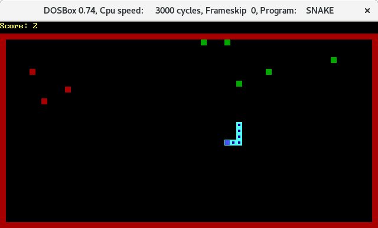
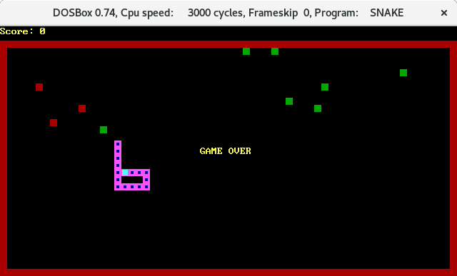
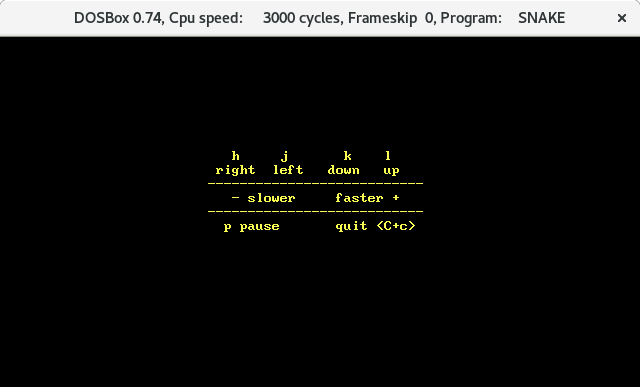

Snake
=====
A simple Snake game for DOS written in TASM.

How to build
--------------
You need a DOS machine with `tasm` and `tlink` to build the game:
```
cd snake
tasm snake.asm
tlink /t /x snake.obj
```

How to run
------------
You can just run `snake.com`. Also you can use command line options to set
the snake color, the snake length on start and the number of food pieces on the map.

Screenshots
-------------




